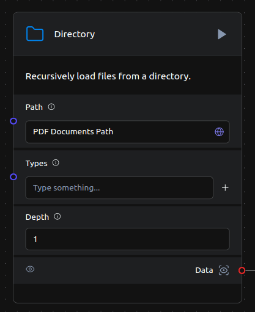
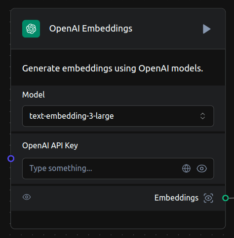
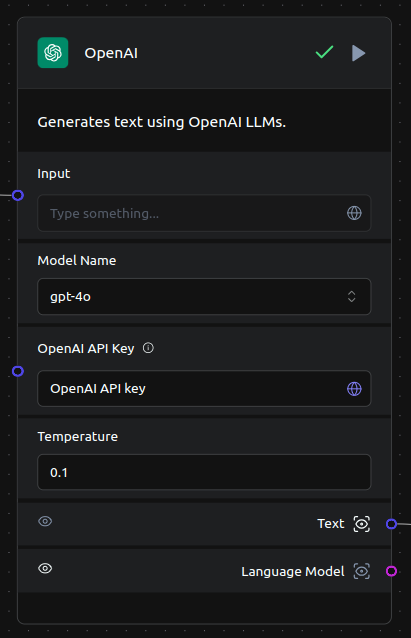
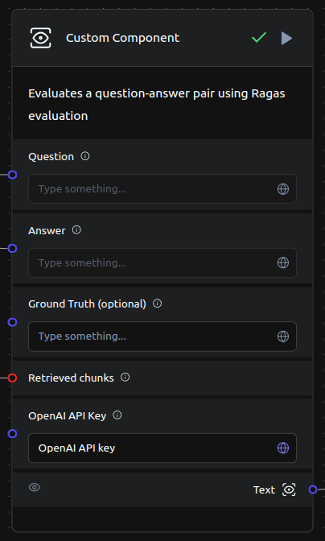
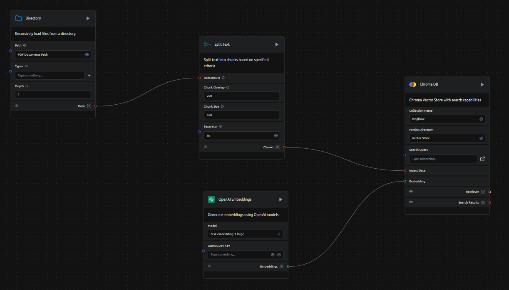
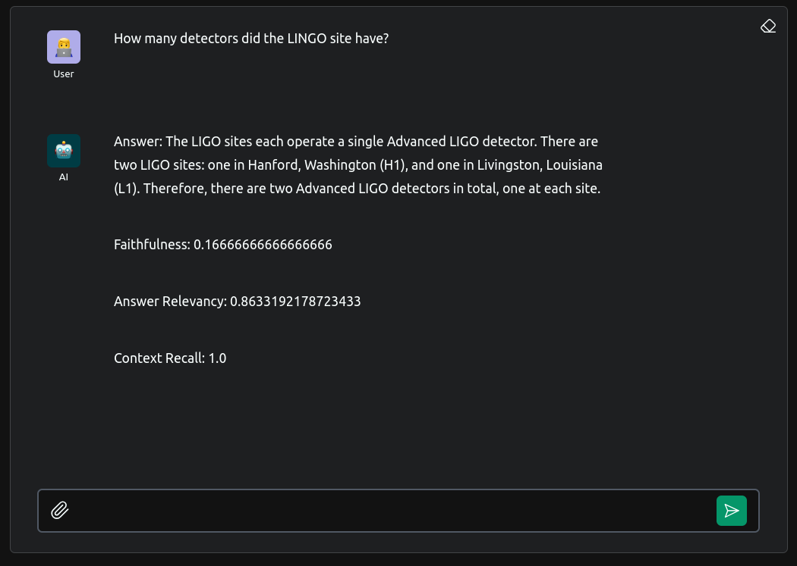

# Ragas Evaluation on Langflow

Clone the repository


```python
git clone https://github.com/paulomuraroferreira/langflow_ragas.git
```


      Cell In[2], line 1
        git clone https://github.com/paulomuraroferreira/langflow_ragas.git
            ^
    SyntaxError: invalid syntax


Install langflow and ragas:


```python
!pip install langflow run
!pip install ragas
```

On the terminal, execute


```python
langflow run
```

Copy the pdf documents to the pdf_documents folder,
or change the path in the Document Loader component:



Enter your OpenAI API key on both Embeddings components,



on the OpenAI models component,



and on the Ragas custom component:



Run the chunking pipeline by executing the ChromaDB component:



Enter the playground:


