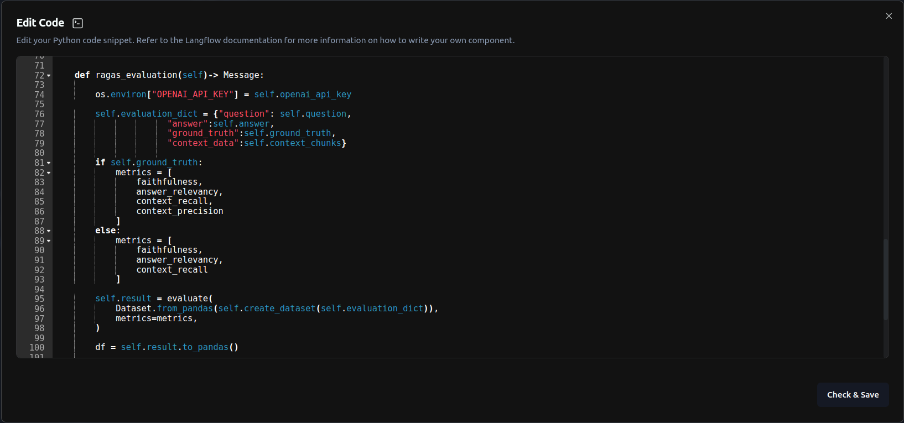
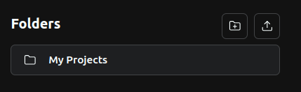

# Ragas Evaluation on Langflow

The repository implements the code for RAGAS metrics faithfulness, answer_relevancy, context_recall, and context_precision (https://docs.ragas.io/en/stable/index.html) on a RAG pipeline.

This is done by creating the custom component ragas_custom_component.json.




# Tutorial

Clone the repository


```python
git clone https://github.com/paulomuraroferreira/langflow_ragas.git
```

Install langflow and ragas:


```python
!pip install langflow run
!pip install ragas
```

On the terminal, execute


```python
langflow run
```

Upload the json RAG pipeline RAGAS metrics.json



Copy the pdf documents to the pdf_documents folder,
or change the path in the Document Loader component:


Enter your OpenAI API key on both Embeddings components,


on the OpenAI models component,


and on the Ragas custom component:


Run the chunking pipeline by executing the ChromaDB component:


Enter the playground and ask questions:


